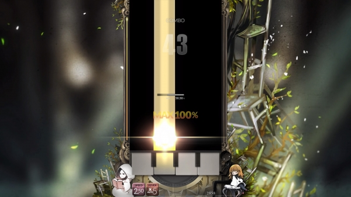
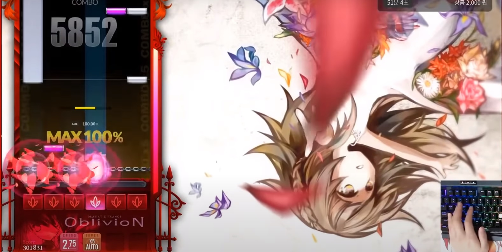
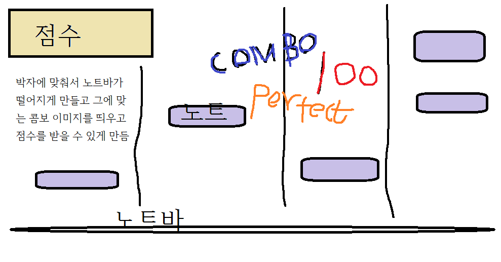

# [컨셉]
## 메인컨셉 : 사운드
 - 리듬게임에서 가장 중요한 음악을 직접 만들어서 게임에 사용하여 처음듣는 신박한 음악을 이용

 - 짧은 시간에 짧게 즐길 수 있게 음악 게임을 제작

### 서브 컨세 1 : 편의성
 - 언제든 키고/끄고 하면서 자신이 원할때 게임을 이용할 수 있는게 포인트

 - 모바일로 이용이 가능하게 만들어서 장소 제한 없이 사용 가눙하게 구현

### 서브 컨세 2 : 접근성
- 완전히 어려운 게임이 아닌 한번 보고도 이해할 수 있는 게임을 구현

 - 연령 제한 없이 쉽게 플레이 가능

### 서브 컨세 3 : 랭킹성
-  게임을 플레이하고 점수를 저장하여 순위를 매겨 경쟁할 수 있게 구현

### 서브 컨세 4 : 다양성
- 직접 제작한 브금을 사용할 예정으로 다양한 음악을 만들어서 한가지가 아닌 여러가지 음악을 플레이 할 수 있게 만듬

 - 다양한 종류의 브금으로 자신의 취향에 맞게 선택

### 서브 컨세 5 : 로그인
- 로그인을 할 수 있게 만들어서 자신이 플레이하여 점수를 남길때 로그인 할때 사용한 이름이 저장 될 수 있게 만듬

  
# [관련 이미지 & 동영상]
- 이미지  

- 동영상

  
# [대표 이미지]

  
# [컨셉 & 대표이미지 기반 작품묘사]
> ### 대표이미지 기반 : 위에서 노래 박자에 맞춰서 노트바가 떨어지게 만들고 그에 맞는 콤보 이미지를 띄우고 점수를 받을 수 있게 만들었다.

> ### 컨셉 기반: 자신이 원하는 음악을 선택하여 플레이하고 점수를 남겨 순위권에 남겨보자.

  
# [<게임제목> 구성 요소]

-  뮤직 사운드

 

## 1. 메커니즘

[도전 과제]
1) 음악에 맞춰 떨어지는 노트바를 클릭해라
2) 노트바를 틀리지 않고 맞추면 콤보가 올라가 추가 점수를 받는다.

[재미 요소]
1) 각 음악에 따라 노트바의 박자가 다르다.
2) 노트바를 클릭할때 악기의 소리를 넣어 자신이 연주하는 느낌을 들 수 있게 만든다.
3) 각 음악에 따라 점수로 랭킹을 나눌 수 있다.

 

## 2. 이야기

[만들게 된 배경]  
- 리듬게임을 만들어 본적 있는데 그 당시 리듬게임은 완성도가 많이 부족하여 조금더 완성도 높은 게임을 만들고자 다시 만들게 되었다.

 

## 3. 미적요소

[디자인]
- 각 음악마다 배경이 다르고 콤보를 쌓을때 주는 점수가 다르다.

[컬러]  
- 콤보의 수마다 보이는 색상이 다르다.

[음향]  
- 자신이 선택한 음악의 분위기에 따라 노트바를 눌렀을때 소리가 다르다.
	
 

## 4. 기술  
